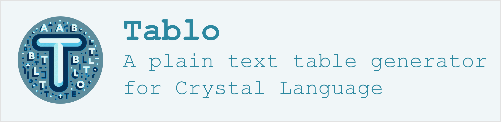

## About Tablo

Tablo is a Crystal library that facilitates the creation of tabular
layouts from a set of enumerable data.

It's very easy to use: just supply a data set and define a few columns,
and you're done. Most of its other optional parameters have commonly
used default values, but they can be refined to produce relatively
complex layouts if required.

## History

Tablo was originally adapted from Matt Harvey's
[Tabulo](https://github.com/matt-harvey/tabulo) Ruby gem. The first
version (v0.10.1) was released on November 30, 2021, as part of the
Crystal language learning, which explains its relative limitations
compared with Tabulo v2.7, the current version at the time.

The current version of Tablo (v1.00.0) is an almost complete rewrite of
the library.

Compared to the first version, it offers extended capabilities,
sometimes at the cost of modified syntax. It also offers new features,
such as the possibility of adding a summary table, fed by user-defined
functions (sum, average, etc.), the ability to process any
enumerable data, as well as elaborate layout possibilities: grouped,
masked and reordered columns, different types of headers (title,
subtitle, footer), detached or joined border lines, etc.

While overall, Tablo remains, in terms of its functionalities, broadly
comparable, with a few exceptions, to the Tabulo v3.0 version of Matt Harvey,
the source code, meanwhile, has been deeply redesigned.

## Main features

- Tablo's formatting is column-oriented. This ensures automatic
  synchronization between headers and bodies.

- With the exception of the source dataset (which can be any
  Enumerable), all other table creation parameters have a default
  value, which in turn is the default value for column creation.

- Column widths can be freely defined, with content adapting
  automatically. They can also be recalculated according to the content of
  each cell or the desired total width of the table.

- Adjacent columns can be capped by a group header.

- Columns can be selected and reordered at display time.

- Optionally, the table can have a title, a subtitle or a footer.

- Headers (and title and subtitle) row can be repeated at arbitrary intervals.

- Alignment of header and body cells is configurable, but by default,
  numbers are right-aligned, Boolean values centered, other types
  left-aligned. By default, title, subtitle, footer and group header
  are centered.

- Apply colors and other styling to table content and borders.

- Choose from several border configurations, predefined or user-defined ones.

- Step through your table a row at a time, for custom layouts.

- Easily transpose the table, so that rows are swapped with columns.

- A summary can be added at the bottom of the table by applying
  user-defined functions to column source data. If appropriate, this
  summary table can be attached to the main table to form a single
  layout for display.

## Installation

1. Add the dependency to your shard.yml:

```yaml
dependencies:
  tablo:
    github: hutou/tablo
```

2. Run `shards install`

## Usage

Insert the line

```crystal
require "tablo"
```

at the beginnning of your app.

To get a taste of how to use the Tablo library, run the code below:

```crystal
require "tablo"
table = Tablo::Table.new([1, 2, 3]) do |t|
  t.add_column("Itself", &.itself)
  t.add_column("Double") { |n| n * 2 }
end
puts table
```

to display a formatted table of some integers with their doubles:

```
+--------------+--------------+
|       Itself |       Double |
+--------------+--------------+
|            1 |            2 |
|            2 |            4 |
|            3 |            6 |
+--------------+--------------+
```

See the [Tutorial and detailed API](https://hutou.github.io/tablo) for
a step-by-step introduction to the library, followed by a complete API
of public classes and methods, their usage and their parameters.

## Contributing

1. Fork it: https://github.com/hutou/tablo/fork
2. Create your Feature Branch (`git checkout -b my-new-feature`)
3. Commit your Changes (`git commit -m 'Add some feature'`)
4. Push to the Branch (`git push origin my-new-feature`)
5. Create a Pull Request

## License

Distributed under the MIT License. See [LICENSE](LICENSE) for more information.

## Contributors

[hutou](https://github.com/hutou) - Creator and maintainer <br />
[koffeinfrei](https://github.com/koffeinfrei) - Contributor
