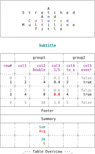

== History

Tablo is a port of [Matt Harvey's
Tabulo](https://github.com/matt-harvey/tabulo) Ruby gem to the Crystal
Language.

The first version of Tablo (v0.10.1) was released on November 30, 2021,
in the context of learning the Crystal language, which explains its
relative limitations compared to Tabulo v2.7, the current version
at that time, subject of the software port.

So this version of Tablo (v1.0) is a complete rewrite of the library.

Compared to the first version, it offers extended capabilities,
sometimes at the cost of a modified syntax. It also offers new features,
such as the ability to add a Summary table, powered by user-defined
functions (such as sum, mean, etc.), the ability to process any
Enumerable data, as well as elaborate layout possibilities: grouped
columns, different types of headers (title, subtitle, footer), linked or
detached border lines, etc.

While overall, Tablo remains, in terms of its functionalities, broadly
comparable, with a few exceptions, to the Tabulo v3.0 version of Matt
Harvey, the source code, meanwhile, has been deeply redesigned.

{empty} +

== Features

- Presents a DRY API that is column-based, not row-based, meaning header and body rows are automatically in sync
- Lets you set fixed column widths, then either wrap or truncate the overflow
- Alternatively, “pack” the table so that columns are auto-sized to their contents
- Cell alignment is configurable, but has helpful content-based defaults (numbers right, strings left)
- Tabulate any Enumerable: the underlying collection need not be an array
- Step through your table a row at a time, printing as you go, without waiting for the underlying collection to load. In other words, have a streaming interface for free.
- Add optional title, subtitle and footer to your table
- The header row can be repeated at arbitrary intervals
- Newlines within cell content are correctly handled
- Multibyte Unicode characters are correctly handled (needs the "uniwidth" library)
- Option to preserve whole words when wrapping content
- Apply colors and other styling to table content and borders, without breaking the table
- Easily transpose the table, so that rows are swapped with columns
- Choose from several border configurations, including predefined ones such as Markdown, Ascii (default), and user-defined ones.
- Adjacent columns can be capped by a group header
- A summary table can be added to apply user-defined functions to numeric values of a column

{empty} +

== Usage

```crystal
require "tablo"
```

== Getting started

== Overview

To give you a taste of both the richness of the layout, here's an example that's somewhat contrived, but interesting to study.



{empty} +

and the corresponding source code.

[source,Crystal]
----
include::docs/assets/sources/overview.cr[]
----
