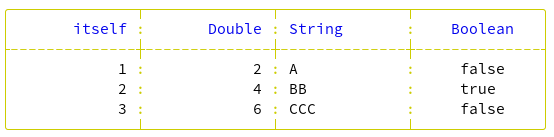
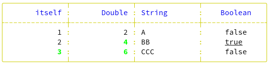

<!-- [](https://github.com/hutou/tablo/tree/development?tab=readme-ov-file) -->


## Table of contents

- [Getting started](#getting-started)
- [Borders](#borders)
- [Row types](#row-types)
  - [Header and Body](#header-and-body)
  - [Group](#group)
  - [Headings](#headings)
- [Rules](#rules)
- [Display frequency and repeated title](#display-frequency-and-repeated-title)
- [Extracting - Formatting - Styling](#extracting---formatting---styling)
  - [Extracting](#extracting)
  - [Formatting](#formatting)
  - [Styling](#styling)
- [Packing](#packing)
- [Summary](#summary)
- [Transpose](#transpose)
- [Columns selection and ordering](#columns-selection-and-ordering)
- [Tips and tricks](#tips-and-tricks)

## Getting started

In this tutorial, we'll start with a very simple example, which we'll build on
as we go along to gradually discover all the possibilities offered by the
Tablo library.

Here's a first look at how to use Tablo to lay out a simple table from an array
of integers.

```crystal
require "tablo"
table = Tablo::Table.new([1, 2, 3]) do |t|
  t.add_column("itself", &.itself)
  t.add_column(2, header: "Double") { |n| n * 2 }
  t.add_column(:column_3, header: "String") { |n| ('@'.ord + n).chr.to_s * n }
end
puts table
```

or

```crystal
require "tablo"
table = Tablo::Table.new([1, 2, 3])
table.add_column("itself", &.itself)
table.add_column(2, header: "Double") {|n| n * 2}
table.add_column(:column_3, header: "String") { |n| ('@'.ord + n).chr.to_s * n }
puts table
```

output:

```
+--------------+--------------+--------------+
|       itself |       Double | String       |
+--------------+--------------+--------------+
|            1 |            2 | A            |
|            2 |            4 | BB           |
|            3 |            6 | CCC          |
+--------------+--------------+--------------+
```

A great deal of information can already be extracted from this simple example:

- The only parameter required to create the table is the data source (the
  array of integers), but to produce a result, you obviously need to add
  columns.
- Any number of columns can be defined, each requiring an identifier and
  a proc for extracting data from the source and, if necessary, modifying
  its type and value.
- The column identifier can be of type `String`, `Integer` or `Symbol`. By default,
  the column header takes the value of the identifier, unless the optional
  `header` parameter is used.
- Columns are the same width.
- We can see two types of row: header and body.
- Columns of numbers are aligned to the right, and columns of text to the left, for
  both headers and body.
- Default borders use the classic `Ascii` type.

## Borders

The Border structure lets you create frames around rows and columns, using
ascii and/or graphic characters.

A set of predefined borders is available, including `Ascii`,
`ReducedAscii` and `Fancy`, but you can also define your own border
types (see API for details).

Default border type is `Ascii`, but to change a table's border type,
simply assign the desired definition to the `border` parameter when
initializing the table. So, for example, to set the `ReducedAscii`
border type, you can do:

```crystal
table = Tablo::Table.new([1, 2, 3],
  border: Tablo::Border.new(Tablo::Border::PreSet::ReducedAscii)) do |t|
```

or even, more simply:

```crystal
table = Tablo::Table.new([1, 2, 3],
  border: Tablo::Border.new(:reduced_ascii)) do |t|
```

```text
-------------- -------------- --------------
       itself         Double   String
-------------- -------------- --------------
            1              2   A
            2              4   BB
            3              6   CCC
-------------- -------------- --------------
```

## Row types

### Header and Body

The Header and Body data row types form the basis of table formatting. Other
types can be optionally added to establish the final layout: the Group row
type and Heading row types (Title, SubTitle and Footer).

### Group

Adjacent columns can share a common header, above the column headers
themselves. This common header constitutes a Group row type.

To create a Group row, simply define a common header after each set of
adjacent columns to be grouped.

```crystal
require "tablo"
table = Tablo::Table.new([1, 2, 3]) do |t|
  t.add_column("itself", &.itself)
  t.add_column(2, header: "Double") {|n| n * 2}
  t.add_group("Numbers")
  t.add_column(:column_3, header: "String") { |n| ('@'.ord + n).chr.to_s * n }
  t.add_group("Text")
end
puts table
```

Output:

```
+-----------------------------+--------------+
|           Numbers           |     Text     |
+--------------+--------------+--------------+
|       itself |       Double | String       |
+--------------+--------------+--------------+
|            1 |            2 | A            |
|            2 |            4 | BB           |
|            3 |            6 | CCC          |
+--------------+--------------+--------------+
```

By default, Group headers are centered, but their alignment can be modified
globally at table initialization time with the `group_alignment` parameter,
or locally for a given group with the `alignment` parameter.

```crystal
require "tablo"

table = Tablo::Table.new([1, 2, 3],
  group_alignment: Tablo::Justify::Left) do |t|
  t.add_column("itself", &.itself)
  t.add_column(2, header: "Double") { |n| n * 2 }
  t.add_group("Numbers")
  t.add_column(:column_3, header: "String") { |n| ('@'.ord + n).chr.to_s * n }
  t.add_group("Text")
end
puts table
```

Output:

```
...
| Numbers                     | Text         |
...
```

or

```crystal
require "tablo"
table = Tablo::Table.new([1, 2, 3]) do |t|
  t.add_column("itself", &.itself)
  t.add_column(2, header: "Double") { |n| n * 2 }
  t.add_group("Numbers")
  t.add_column(:column_3, header: "String") { |n| ('@'.ord + n).chr.to_s * n }
  t.add_group("Text", alignment: Tablo::Justify::Left)
end
puts table
```

Output:

```
...
|           Numbers           | Text         |
...
```

Note that the group header can be empty, and that an empty group header is
automatically created if the last column group is not specified.

Group and header are intimately linked and only separated by a horizontal
line. For custom rendering, this line can be omitted by setting the Table
`omit_group_header_rule` parameter to `true`.

```crystal
require "tablo"

table = Tablo::Table.new([1, 2, 3],
        omit_group_header_rule: true) do |t|
    t.add_column("itself", &.itself)
    t.add_column(2, header: "Double") {|n| n * 2}
    t.add_group("Numbers")
    t.add_column(:column_3, header: "String") { |n| ('@'.ord + n).chr.to_s * n }
    t.add_column(:column_4, header: "Boolean") {|n| n.even?}
    t.add_group("Other data types")
end

puts table
```

Output:

```
+-----------------------------+-----------------------------+
|           Numbers           |       Other data types      |
|       itself |       Double | String       |    Boolean   |
+--------------+--------------+--------------+--------------+
|            1 |            2 | A            |     false    |
|            2 |            4 | BB           |     true     |
|            3 |            6 | CCC          |     false    |
+--------------+--------------+--------------+--------------+
```

### Headings

A formatted table can optionally include a title, subtitle and footer. Each of
these elements is of type Heading (see API).

By default, when the table is initialized, their value is `nil`, so nothing is
displayed.

To display a title (or subtitle or footer), simply specify its value when
initializing the table.

```crystal
require "tablo"
table = Tablo::Table.new([1, 2, 3],
  title: Tablo::Heading.new("Data types alignment")) do |t|
  t.add_column("itself", &.itself)
  t.add_column(2, header: "Double") { |n| n * 2 }
  t.add_group("Numbers")
  t.add_column(:column_3, header: "String") { |n| ('@'.ord + n).chr.to_s * n }
  t.add_column(:column_4, header: "Boolean") { |n| n.even? }
  t.add_group("Other data types")
end
puts table
```

Output:

```
                     Data types alignment
+-----------------------------+-----------------------------+
|           Numbers           |       Other data types      |
+--------------+--------------+--------------+--------------+
|       itself |       Double | String       |    Boolean   |
+--------------+--------------+--------------+--------------+
|            1 |            2 | A            |     false    |
|            2 |            4 | BB           |     true     |
|            3 |            6 | CCC          |     false    |
+--------------+--------------+--------------+--------------+
```

These elements can also be framed, possibly with line breaks before and after
(defined in the `Heading::Frame` struct initializer as `line_breaks_before` and
`line_breaks_after` with a default value of 0).

The number of line breaks between adjacent elements is equal to the highest
value between the current element's `line_breaks_after` and the next element's
`line_breaks_before`.

```crystal
table = Tablo::Table.new([1, 2, 3],
  title: Tablo::Heading.new("Data types alignment",
    framed: true, line_breaks_before: 0, line_breaks_after: 2)) do |t|
  ...
```

Output:

```
+-----------------------------------------------------------+
|                    Data types alignment                   |
+-----------------------------------------------------------+

+-----------------------------+-----------------------------+
|           Numbers           |       Other data types      |
+--------------+--------------+--------------+--------------+
|       itself |       Double | String       |    Boolean   |
+--------------+--------------+--------------+--------------+
|            1 |            2 | A            |     false    |
|            2 |            4 | BB           |     true     |
|            3 |            6 | CCC          |     false    |
+--------------+--------------+--------------+--------------+
```

In summary, we have 6 types of data rows :


|Type|Description
|---|----
|Body|Always displayed
|Group|Optional
|Title|Optional
|Subtitle|Optional
|Footer|Optional


<!-- | Header   | Always displayed, unless `header_frequency:` is `nil` </br> or `masked_headers:` is `true` | -->

## Rules

Between the different types of data rows, there are also different types
of separation rules, whose format varies according to the types of rows
they separate.

In the case of framed rows, for example, there may be a single
separating rule, making the rows linked, or on the contrary, there may
first be a closing rule for the top row, possibly followed by line
breaks before the opening rule for the bottom row.

These horizontal rules are formatted by the `horizontal_rule` method of class
Border.

## Display frequency and repeated title

An important parameter in table initialization is `header_frequency:`

- By default, it is set to 0, i.e. rows of data other than body are displayed
  only once, at the beginning for titles and headers, at the end for the footer.

```crystal
require "tablo"
table = Tablo::Table.new([1, 2, 3],
  # header_frequency: 0,
  title: Tablo::Heading.new("Data types alignment",
    framed: true, line_breaks_before: 0, line_breaks_after: 2),
  subtitle: Tablo::Heading.new("Only Booleans are centered by default"),
  footer: Tablo::Heading.new("End of page")) do |t|
  t.add_column("itself", &.itself)
  t.add_column(2, header: "Double") { |n| n * 2 }
  t.add_group("Numbers")
  t.add_column(:column_3, header: "String") { |n| ('@'.ord + n).chr.to_s * n }
  t.add_column(:column_4, header: "Boolean") { |n| n.even? }
  t.add_group("Other data types")
end
puts table
```

Output:

```
+-----------------------------------------------------------+
|                    Data types alignment                   |
+-----------------------------------------------------------+

            Only Booleans are centered by default
+-----------------------------+-----------------------------+
|           Numbers           |       Other data types      |
+--------------+--------------+--------------+--------------+
|       itself |       Double | String       |    Boolean   |
+--------------+--------------+--------------+--------------+
|            1 |            2 | A            |     false    |
|            2 |            4 | BB           |     true     |
|            3 |            6 | CCC          |     false    |
+--------------+--------------+--------------+--------------+
                         End of page  ``
```

- If set to `nil`, only body rows are displayed.

```crystal
table = Tablo::Table.new([1, 2, 3],
        header_frequency: nil,
...
```

Output:

```
+--------------+--------------+--------------+--------------+
|            1 |            2 | A            |     false    |
|            2 |            4 | BB           |     true     |
|            3 |            6 | CCC          |     false    |
+--------------+--------------+--------------+--------------+
```

- If set to `n` (positive), group or column headers are repeated every `n`
  rows, as are footers, but titles and subtitles are not repeated.

```crystal
table = Tablo::Table.new([1, 2, 3],
        header_frequency: 2,
...
```

Output:

```
+-----------------------------------------------------------+
|                    Data types alignment                   |
+-----------------------------------------------------------+

            Only Booleans are centered by default
+-----------------------------+-----------------------------+
|           Numbers           |       Other data types      |
+--------------+--------------+--------------+--------------+
|       itself |       Double | String       |    Boolean   |
+--------------+--------------+--------------+--------------+
|            1 |            2 | A            |     false    |
|            2 |            4 | BB           |     true     |
+--------------+--------------+--------------+--------------+
                         End of page
+-----------------------------+-----------------------------+
|           Numbers           |       Other data types      |
+--------------+--------------+--------------+--------------+
|       itself |       Double | String       |    Boolean   |
+--------------+--------------+--------------+--------------+
|            3 |            6 | CCC          |     false    |
|              |              |              |              |
+--------------+--------------+--------------+--------------+
                         End of page ``
```

However, if the title `repeated` parameter is set to `true`, we obtain title and
subtitle repetition.

```crystal
table = Tablo::Table.new([1, 2, 3],
  header_frequency: 2,
  title: Tablo::Heading.new("Data types alignment",
    framed: true, line_breaks_before: 0, line_breaks_after: 2, repeated: true),
...
```

Output:

```
+-----------------------------------------------------------+
|                    Data types alignment                   |
+-----------------------------------------------------------+

            Only Booleans are centered by default
+-----------------------------+-----------------------------+
|           Numbers           |       Other data types      |
+--------------+--------------+--------------+--------------+
|       itself |       Double | String       |    Boolean   |
+--------------+--------------+--------------+--------------+
|            1 |            2 | A            |     false    |
|            2 |            4 | BB           |     true     |
+--------------+--------------+--------------+--------------+
                         End of page
+-----------------------------------------------------------+
|                    Data types alignment                   |
+-----------------------------------------------------------+

            Only Booleans are centered by default
+-----------------------------+-----------------------------+
|           Numbers           |       Other data types      |
+--------------+--------------+--------------+--------------+
|       itself |       Double | String       |    Boolean   |
+--------------+--------------+--------------+--------------+
|            3 |            6 | CCC          |     false    |
|              |              |              |              |
+--------------+--------------+--------------+--------------+
                         End of page
```

## Extracting - Formatting - Styling

At the heart of Tablo's operations is the Cell, a data structure containing
all the elements required for display.

A cell, whether fed by data extracted from the source or directly from the
code, can span several lines. Even if it initially occupies a single line,
reducing the column width can result in a cell being displayed over several
lines.

Inside a cell, you can limit the number of lines displayed by using the
`header_wrap` or `body_wrap` parameters when initializing the table
(These 2 parameters are global to the table, and cannot be set on
individual columns). If the whole cell content cannot be displayed due
to this restriction, a special character (tilde by default) is inserted
in the right-hand padding area of the last line of the cell (unless
right padding is set to 0 for the column).

Note here the use of the `row_divider_frequency` parameter to separate body
rows

Note also in this example the direct use of a character string for
border elements, with the last 4 characters defining the separating
lines between Heading(title, subtitle and footer), Group, Header and
Body rows respectively.

```crystal
require "tablo"
table = Tablo::Table.new(["First\nrow", "Second row\nextending\nover\nfour lines", "Last row"],
  title: Tablo::Heading.new("Title", framed: true),
  subtitle: Tablo::Heading.new("SubTitle", framed: true),
  border: Tablo::Border.new("+++++++++|||*=-."),
  header_wrap: 4,
  body_wrap: 3,
  row_divider_frequency: 1) do |t|
  t.add_column("Column\nheader\nextending\nover\n5 lines", &.itself)
  t.add_group("Group header")
end
puts table
```

Output:

```
+**************+
|     Title    |
+**************+
|   SubTitle   |
+**************+
| Group header |
+==============+
| Column       |
| header       |
| extending    |
| over        ~|
+--------------+
| First        |
| row          |
+..............+
| Second row   |
| extending    |
| over        ~|
+..............+
| Last row     |
+**************+
```

In addition, to have greater control over the line break, we can use the
`wrap_mode` parameter to choose between `Rune` (roughly equivalent to
a character) and `Word` (default) when cutting a line.

To use Tablo with non-Romanic languages, it is mandatory to use the
`naqviz/uni_char_width` shard so that the width of each grapheme is correctly
managed, without impacting alignment.

Here is an example of bad formatting when this shard is omitted :

```crystal
require "tablo"
table = Tablo::Table.new(["Crystal\nクリスタル"],
  header_frequency: nil) do |t|
  t.add_column(1, &.itself)
end
puts table
```

Output (image):

 <p>  </p>

To correct this, you need to:

- Add the dependencies to your shard.yml:

```yaml
dependencies:
  tablo:
    github: hutou/tablo
  uniwidth:
    github: naqvis/uni_char_width
```

- Run `shards install`
- And insert the lines

```crystal
require "tablo"
require "uniwidth"
```

at the beginning of your app, like this :

```crystal
require "tablo"
require "uniwidth"
table = Tablo::Table.new(["Crystal\nクリスタル"],
  header_frequency: nil) do |t|
  t.add_column(1, &.itself)
end
puts table
```

Output (image):

 <p>  </p>

### Extracting

The cell `value` attribute contains the raw data.

If directly given as argument to Headings or Group, the cell is a `TextCell`
as it is not related to source data.

If extracted from the source (body rows), the cell is of type `DataCell`, and
the corresponding column header is also a `DataCell` (as it depends on the
type of body `value` for alignment).

The `coords` attribute, specific to the `DataCell` type, provides access to
the cell's coordinates (`row_index` and `column_index`), as well as the
`body_value`. This information is used to activate conditional formatting and
styling.

```crystal
struct Cell::Data::Coords
getter body_value, row_index, column_index
    def initialize(@body_value : CellType, @row_index : Int32, @column_index : Int32)
    end
end
```

The type of `value` is `Tablo::CellType`, which is simply defined as an empty
module restriction type:

```crystal
module Tablo::CellType
end
```

This module is already included in most of Crystal's scalar types. To
use a scalar type (not or less commonly used) or a stdlib or
user-defined class or struct, it is mandatory to include it by reopening
the class or struct.

For example, to allow a cell value to contain an array, we could do :

```crystal
require "tablo"
class Array
  include Tablo::CellType
end
table = Tablo::Table.new([[1, 2], [3, 4]]) do |t|
  t.add_column("itself") { |n| n }
end
puts table
```

Output:

```
+--------------+
| itself       |
+--------------+
| [1, 2]       |
| [3, 4]       |
+--------------+
```

### Formatting

Formatting consists in applying a transformation to the raw data (the `value`)
to obtain a character string ready to be displayed. The simplest
transformation (which is also the one applied by default) is simply a call to
the `to_s` method.

Using a `Proc` `formatter` allows you to customize formatting in a variety of
ways, from using `sprintf` formatting strings for numeric values to various
`String` methods for text and specific `Tablo::Functions` methods for both.

A formatter `Proc` can take four forms : the first two apply equally to TextCell
and DataCell and are applied unconditionally on `value`.

The first form expects one parameter (`value`) and the second two: `value` and
`width` (column width).

Here is an example of the first form:

```crystal
require "tablo"
table = Tablo::Table.new([1, 2, 3]) do |t|
  t.add_column("itself", &.itself)
  t.add_column(2, header: "Double") { |n| n * 2 }
  t.add_column(3, header: "Float",
    header_formatter: ->(value : Tablo::CellType) { value.as(String).upcase },
    body_formatter: ->(value : Tablo::CellType) {
      "%.3f" % value.as(Float)
    }) { |n| n ** 0.5 }
end
puts table
```

Output:

```
+--------------+--------------+--------------+
|       itself |       Double |        FLOAT |   <1>
+--------------+--------------+--------------+
|            1 |            2 |        1.000 |
|            2 |            4 |        1.414 |
|            3 |            6 |        1.732 |
+--------------+--------------+--------------+
```

<1> Note that the FLOAT column is aligned to the right, as its alignment is
governed by the type of `value`, which is a float.

If the formatting were done directly at the data extraction level, `value`
would be of type `String` and column would be aligned to the left.

```crystal
require "tablo"
table = Tablo::Table.new([1, 2, 3]) do |t|
  t.add_column("itself", &.itself)
  t.add_column(2, header: "Double") { |n| n * 2 }
  t.add_column(3, header: "Float",
    header_formatter: ->(value : Tablo::CellType) {
    value.as(String).upcase }) { |n| "%.3f" % (n ** 0.5)
  }
end
puts table
```

Output:

```
+--------------+--------------+--------------+
|       itself |       Double | FLOAT        |
+--------------+--------------+--------------+
|            1 |            2 | 1.000        |
|            2 |            4 | 1.414        |
|            3 |            6 | 1.732        |
+--------------+--------------+--------------+
```

To illustrate the 2nd form, we will use the `Tablo::Functions.stretch` method,
which can be useful for groups or headings.

```crystal
require "tablo"
table = Tablo::Table.new([1, 2, 3]) do |t|
  t.add_column("itself", &.itself)
  t.add_column(2, header: "Double") { |n| n * 2 }
  t.add_group("Numbers",
    formatter: ->(value : Tablo::CellType, width : Int32) {
      Tablo::Functions.stretch(value.as(String), width, ' ')
    })
  t.add_column(:column_3, header: "String") { |n| ('@'.ord + n).chr.to_s * n }
  t.add_column(:column_4, header: "Boolean") { |n| n.even? }
  t.add_group("Other data types")
end
puts table
```

Output:

```
+-----------------------------+-----------------------------+
|  N   u   m   b   e   r   s  |       Other data types      |
+--------------+--------------+--------------+--------------+
|       itself |       Double | String       |    Boolean   |
+--------------+--------------+--------------+--------------+
|            1 |            2 | A            |     false    |
|            2 |            4 | BB           |     true     |
|            3 |            6 | CCC          |     false    |
+--------------+--------------+--------------+--------------+
```

Form 3 and form 4 apply only on DataCell cell types, as they use the
`coords` parameter to conditionnally format the `value`.

Here is an exemple of form 3 with another method from `Tablo::Functions`, which uses
the `column_index` as formatting condition.

```crystal
require "tablo"
table = Tablo::Table.new([-30.00001, -3.14159, 0.0, 1.470001, 5.78707, 10.0],
  body_formatter: ->(value : Tablo::CellType, coords : Tablo::Cell::Data::Coords) {
    case coords.column_index
    when 1 then Tablo::Functions.fp_align(value.as(Float), 4, Tablo::Functions::FPAlign::Blank)
    when 2 then Tablo::Functions.fp_align(value.as(Float), 4, Tablo::Functions::FPAlign::NoDot)
    when 3 then Tablo::Functions.fp_align(value.as(Float), 4, Tablo::Functions::FPAlign::DotOnly)
    when 4 then Tablo::Functions.fp_align(value.as(Float), 4, Tablo::Functions::FPAlign::DotZero)
    else        value.as(Float).to_s
    end
  }) do |t|
  t.add_column("itself", &.itself)
  t.add_column("1 - Blank", &.itself)
  t.add_column("2 - NoDot", &.itself)
  t.add_column("3 - DotOnly", &.itself)
  t.add_column("4 - DotZero", &.itself)
end
puts table
```

Output:

```
+--------------+--------------+--------------+--------------+--------------+
|       itself |    1 - Blank |    2 - NoDot |  3 - DotOnly |  4 - DotZero |
+--------------+--------------+--------------+--------------+--------------+
|    -30.00001 |     -30      |     -30      |     -30.     |     -30.0    |
|     -3.14159 |      -3.1416 |      -3.1416 |      -3.1416 |      -3.1416 |
|          0.0 |              |       0      |       0.     |       0.0    |
|     1.470001 |       1.47   |       1.47   |       1.47   |       1.47   |
|      5.78707 |       5.7871 |       5.7871 |       5.7871 |       5.7871 |
|         10.0 |      10      |      10      |      10.     |      10.0    |
+--------------+--------------+--------------+--------------+--------------+
```

Incidentally, this last example displays all the formatting possibilities of
the `Tablo::Functions.fp_align` method.

Compared to the third form, form 4 also allows the use of the width value.

Just for fun, here is a slightly contrived example:

```crystal
require "tablo"
table = Tablo::Table.new([1, 2, 3, 4, 5, 6, 7, 8, 9]) do |t|
  t.add_column(:column_3, header: "King's crown", width: 20,
    header_alignment: Tablo::Justify::Center,
    body_alignment: Tablo::Justify::Center,
    body_formatter: ->(value : Tablo::CellType, coords : Tablo::Cell::Data::Coords, width : Int32) {
      Tablo::Functions.stretch(value.as(String), width, ' ')
    }
  ) { |n| ('@'.ord + n).chr.to_s * n }
end
puts table
```

Output:

```
+----------------------+
|     King's crown     |
+----------------------+
|           A          |
| B                  B |
|  C        C        C |
|  D     D     D     D |
|   E   E   E   E   E  |
|   F  F  F  F  F  F   |
|  G  G  G  G  G  G  G |
|    H H H H H H H H   |
|   I I I I I I I I I  |
+----------------------+
```

Overview of the 4 different forms of formatter procs:
| Forms of formatter procs | Parameter and types, in order |
| -- | -- |
| 1st form | `value` : `Tablo::CellType` <br />used by: `TextCell` or `DataCell`|
| 2nd form | `value` : `Tablo::CellType`, `width` : `Int32` <br />used by: `TextCell` or `DataCell` |
| 3rd form | `value` : `Tablo::CellType`, `coords` : `Tablo::Cell::Data::Coords` <br />used by: `DataCell`|
| 4th form | `value` : `Tablo::CellType`, `coords` : `Tablo::Cell::Data::Coords`, <br />`width` : `Int32` used by: `DataCell` |

### Styling

When it comes to terminal styling, the possibilities are limited, especially
as they depend on the terminal's capabilities. There are therefore
2 complementary ways of proceeding:

- Play with the mode (underlined, bold, italic...)
- Use color

This can be done using ANSI code sequences, or preferably, using the
`colorize` module of the standard library.

In this section, we'll be using color, altered characters and graphic borders
with the Fancy border type. Output will therefore be presented as images,
so as to guarantee perfect rendering, whatever the medium used for display.

For styling, there are 5 forms of procs.

The first uses only the (formatted) content as a parameter, and therefore does not
allow conditional styling.

Let's look at a simple example, with yellow borders and blue headers.

```crystal
require "tablo"
require "colorize"
table = Tablo::Table.new([1, 2, 3],
  border: Tablo::Border.new(:fancy, styler: ->(border_char : String) {
    border_char.colorize(:yellow).to_s
  }),
  header_styler: ->(content : String) { content.colorize(:blue).to_s }) do |t|
  t.add_column("itself", &.itself)
  t.add_column(2, header: "Double") { |n| n * 2 }
  t.add_column(:column_3, header: "String") { |n| ('@'.ord + n).chr.to_s * n }
  t.add_column(:column_4, header: "Boolean") { |n| n.even? }
end
puts table
```

Output:

<p> 

Cool! Let's do now some conditional styling, painting in bold green all values
greater than 2 in all numeric columns and underlining the `true` boolean value
in fourth column: this is the third form of styling.
Just add, at the table level before `header_styler`, the following lines :

```crystal
body_styler: ->(value : Tablo::CellType, content : String) {
  case value
  when Int32
    value > 2 ? content.colorize.fore(:green).mode(:bold).to_s : content
  else
    value == true ? content.colorize.mode(:underline).to_s : content
  end
},
```

Output:

<p> </p>

Let's end with a final example, with a black-and-white look: how do you
display rows alternately in black (with a bit of italics) and dark gray
to make them easier to read?

This would be the 4th form.

```crystal
require "tablo"
require "colorize"
table = Tablo::Table.new([1, 2, 3, 4, 5],
  title: Tablo::Heading.new("My black and white fancy table", framed: true),
  footer: Tablo::Heading.new("End of data", framed: true),
  border: Tablo::Border.new(:fancy, ->(border_char : String) {
    border_char.colorize(:dark_gray).to_s
  }),
  body_styler: ->(_value : Tablo::CellType, coords : Tablo::Cell::Data::Coords, content : String) {
    if coords.row_index.even?
      "\e[3m" + content.colorize(:black).to_s + "\e[0m"
    else
      content.colorize.fore(:dark_gray).to_s
    end
  },
  header_styler: ->(content : String) { content.colorize.mode(:bold).to_s }) do |t|
  t.add_column("itself", &.itself)
  t.add_column(2, header: "Double") { |n| n * 2 }
  t.add_column(:column_3, header: "String") { |n| ('@'.ord + n).chr.to_s * n }
end
puts table
```

Output:

<p>  </p>

_*From version 1.10 onwards, Crystal `colorize` module does support italic
mode, and the use of ANSI sequences is given here simply as an
example.*_

Overview of the 5 different forms of styler procs:

| Forms of styler procs | Parameter and types, in order                                                                                                                                   |
| --------------------- | :-------------------------------------------------------------------------------------------------------------------------------------------------------------- |
| 1st form              | `(formatted) content` : `String` <br />used by: `Border`, `TextCell` or `DataCell`                                                                              |
| 2nd form              | `(formatted) content` : `String`, `line_index` : `Int32` <br /> used by: `TextCell`                                                                             |
| 3rd form              | `value` : `Tablo::CellType`, `(formatted) content` : `String` <br /> used by: `DataCell`                                                                        |
| 4th form              | `value` : `Tablo::CellType`, `coords` : `Tablo::Cell::Data::Coords`, <br /> `(formatted) content` : `String` used by: `DataCell`                                |
| 5th form              | `value` : `Tablo::CellType`, `coords` : `Tablo::Cell::Data::Coords`, <br /> `(formatted) content` : `String`, `line_index` : `Int32` <br /> used by: `DataCell` |

## Packing

In the previous examples, the notion of column width was used. For a better
understanding, the diagram below highlights the structure of a column.

<p>  </p>

As we saw at the start of this tutorial, by default, all columns have the same
width, i.e. 12 characters.

Of course, this value can be modified globally when initializing the table, or
individually when defining columns. The same applies to left and right
padding, as well as to the padding character (a space, by default).

The border width is 1 character maximum, but can be 0 (i.e. no border) if the
letter E is used in the border definition string.

The `pack` method is a welcome aid to table formatting. It accepts
3 parameters, all optional:

- `width`: total width required for the formatted table. If no `width` is
  given and if the value of parameter `Config.terminal_capped_width` is true,
  the value of `width` is read from the size of the terminal, otherwise its
  value is `nil` and in that case, only `packing_mode == AutoSized` has an
  effect.

- `packing_mode` : column widths taken as starting point for resizing,
  possible values are :
  - `Current` : resizing starts from columns current width
  - `Initial` : current values are reset to their initial values, at column
    definition time
  - `AutoSized` : current values are set to their 'best fit'
    values, _ie_ they are automatically adapted to their largest content
- `except` or `only` : (array of) column label(s) to be excluded from
  being resized (`except`), or, on the contrary, to be selected for
  packing (`only`).

The following examples will illustrate the behaviour of the different
parameters values, starting from the 'standard' one, with all column widths to
their default value : 12 characters.

```crystal
require "tablo"
data = [
  [1, "Box", "Orange", "Elephant", "Mont St Michel"],
]
table = Tablo::Table.new(data) do |t|
  t.add_column("Primes") { |n| n[0].as(Int32) }
  t.add_column(2, header: "Things") { |n| n[1].as(String) }
  t.add_column(:fruits, header: "Fruits") { |n| n[2].as(String) }
  t.add_column(3, header: "Animals") { |n| n[3].as(String) }
  t.add_column("Famous\nSites") { |n| n[4].as(String) }
end
puts table
puts "table width = #{table.total_table_width}"
```

Table standard output, using default width values, without any packing:

```crystal
puts table
```

```
+--------------+--------------+--------------+--------------+--------------+
|       Primes | Things       | Fruits       | Animals      | Famous       |
|              |              |              |              | Sites        |
+--------------+--------------+--------------+--------------+--------------+
|            1 | Box          | Orange       | Elephant     | Mont St      |
|              |              |              |              | Michel       |
+--------------+--------------+--------------+--------------+--------------+
table width = 76
```

Using default `pack` parameters (ie: none !), we get an optimal packing

```crystal
puts table.pack
```

```
+--------+--------+--------+----------+----------------+
| Primes | Things | Fruits | Animals  | Famous         |
|        |        |        |          | Sites          |
+--------+--------+--------+----------+----------------+
|      1 | Box    | Orange | Elephant | Mont St Michel |
+--------+--------+--------+----------+----------------+
table width = 56
```

But using `pack` with same table width (56) on initial widths values gives
a significantly poorer result

```crystal
puts table.pack(56, packing_mode: Tablo::PackingMode::InitialWidths)
```

```
+----------+----------+----------+----------+----------+
|   Primes | Things   | Fruits   | Animals  | Famous   |
|          |          |          |          | Sites    |
+----------+----------+----------+----------+----------+
|        1 | Box      | Orange   | Elephant | Mont St  |
|          |          |          |          | Michel   |
+----------+----------+----------+----------+----------+
table width = 56
```

This is due to the way Tablo reduces or increases column size. See the
description of the algorithm in the releated section for `Table.pack` in
API.

Using the `width` parameter, any table width can be obtained, by reducing or
increasing the width of each column progressively to reach the desired table
width

```crystal
puts table.pack(30)
```

```
+-----+-----+-----+-----+----+
| Pri | Thi | Fru | Ani | Fa |
| mes | ngs | its | mal | mo |
|     |     |     | s   | us |
|     |     |     |     | Si |
|     |     |     |     | te |
|     |     |     |     | s  |
+-----+-----+-----+-----+----+
|   1 | Box | Ora | Ele | Mo |
|     |     | nge | pha | nt |
|     |     |     | nt  | St |
|     |     |     |     | Mi |
|     |     |     |     | el |
+-----+-----+-----+-----+----+
table width = 30
```

or

```crystal
puts table.pack(90)
```

```
+----------------+-----------------+-----------------+-----------------+-----------------+
|         Primes | Things          | Fruits          | Animals         | Famous          |
|                |                 |                 |                 | Sites           |
+----------------+-----------------+-----------------+-----------------+-----------------+
|              1 | Box             | Orange          | Elephant        | Mont St Michel  |
+----------------+-----------------+-----------------+-----------------+-----------------+
table width = 90
```

There is, however, a limit to the reduction: each column must be able to
accommodate at least one character. Here, we're asking for a table width of
15, but the minimum size to respect this rule is 21!

```crystal
puts table.pack(15)
```

```
+---+---+---+---+---+
| P | T | F | A | F |
| r | h | r | n | a |
| i | i | u | i | m |
| m | n | i | m | o |
| e | g | t | a | u |
| s | s | s | l | s |
|   |   |   | s | S |
|   |   |   |   | i |
|   |   |   |   | t |
|   |   |   |   | e |
|   |   |   |   | s |
+---+---+---+---+---+
| 1 | B | O | E | M |
|   | o | r | l | o |
|   | x | a | e | n |
|   |   | n | p | t |
|   |   | g | h | S |
|   |   | e | a | t |
|   |   |   | n | M |
|   |   |   | t | i |
|   |   |   |   | c |
|   |   |   |   | h |
|   |   |   |   | e |
|   |   |   |   | l |
+---+---+---+---+---+
table width = 21
```

If, with the parameter `packing_mode == Startingwidths::AutoSized` by
default (set by `Config.packing_mode`), the `pack` method automatically
adapts the width of columns to their largest content (body or header) before
resizing, this requires you to go through the entire source dataset, which can
be costly in terms of performance in some cases.

This behavior can be avoided, but possibly with a loss of quality, by changing
the value of `packing_mode` to `Current` or `Initial`. In this case,
however, a value for `width` must be supplied, either directly or by reading
the terminal size, otherwise `pack` will become a non-operation.

Finally, using the `except` parameter, you can temporarily freeze the size of
one or more columns at their current value, so that they are excluded from
resizing.

```crystal
table.pack
puts table.pack(100,except: [2, :fruits])
```

```
+----------------------+--------+--------+-----------------------+-----------------------+
|               Primes | Things | Fruits | Animals               | Famous                |
|                      |        |        |                       | Sites                 |
+----------------------+--------+--------+-----------------------+-----------------------+
|                    1 | Box    | Orange | Elephant              | Mont St Michel        |
+----------------------+--------+--------+-----------------------+-----------------------+
table width = 90
```

The same effect could be obtained by the statements:

```crystal
table.pack
puts table.pack(90, only: ["Primes", 3, "Famous\nSites"])
```

Note that when a column is created using the `add_column` method, the width is
stored in 2 different attributes: the current value and the initial value
(never subsequently modified).

The `pack` method simply modifies the current column width value, and the
`to_s` method then takes care of the layout, and we can save the table in its
output layout in a string with :

```crystal
formatted_table = table.to_s
```

It is therefore equivalent to write :

```crystal
table.pack
puts table
```

or

```crystal
puts table.pack
```

To sum up:

| Type of call                                               | Results, with `PackingMode::AutoSized` as default and no columns excluded                                                                                                                                   |
| :--------------------------------------------------------- | :---------------------------------------------------------------------------------------------------------------------------------------------------------------------------------------------------------- |
| `table.pack`                                               | <ul><li>Automatically adapts columns to their largest content</li><li>Modifies current values of column width</li></ul>                                                                                     |
| `table.pack(40)`                                           | <ul> <li>Automatically adapts columns to their largest content</li> <li>Modifies current values of column width</li> <li>Reduces or increases column widths to meet total table size requirements</li></ul> |
| `table.pack(packing_mode: PackingMode::CurrentWidths`)     | <ul><li>No-op</li></ul>                                                                                                                                                                                     |
| `table.pack(40, packing_mode: PackingMode::CurrentWidths`) | <ul><li>Reduces or increases column widths to meet total table size requirements</li></ul>                                                                                                                  |
| `table.pack(packing_mode: PackingMode::InitialWidths`)     | <ul><li> Only resets current column values to their initial values, no packing is done</li></ul>                                                                                                            |
| `table.pack(40, packing_mode: PackingMode::InitialWidths`) | <ul><li> Resets current column values to their initial values</li> <li>Reduces or increases column widths to meet total table size requirements</li></ul>                                                   |

## Summary

The Tablo library offers a basic yet useful summary method.

At present, it can be used to perform calculations on individual columns of data
and between columns.

Here's a rather complete and detailed example of how it works and what
it can do:

```crystal
require "tablo"
require "colorize"
require "big"

struct BigDecimal
  include Tablo::CellType
end

struct InvoiceItem
  getter product, quantity, price

  def initialize(@product : String, @quantity : Int32?, @price : BigDecimal?)
  end
end

invoice = [
  InvoiceItem.new("Laptop", 3, BigDecimal.new(980)),
  InvoiceItem.new("Printer", 2, BigDecimal.new(154.99)),
  InvoiceItem.new("Router", 1, BigDecimal.new(99)),
  InvoiceItem.new("Switch", nil, BigDecimal.new(45)),
  InvoiceItem.new("Accessories", 5, BigDecimal.new(64.50)),
]

table = Tablo::Table.new(invoice,
  omit_last_rule: true,
  border: Tablo::Border.new(Tablo::Border::PreSet::Fancy),
  title: Tablo::Heading.new("\nInvoice\n=======\n"),
  subtitle: Tablo::Heading.new("Details", framed: true)) do |t|
  t.add_column("Product",
    &.product)
  t.add_column("Quantity",
    body_formatter: ->(value : Tablo::CellType) {
      (value.nil? ? "N/A" : value.to_s)
    }, &.quantity)
  t.add_column("Price",
    body_formatter: ->(value : Tablo::CellType) {
      "%.2f" % value.as(BigDecimal)
    }, &.price.as(Tablo::CellType))
  t.add_column(:total, header: "Total",
    body_formatter: ->(value : Tablo::CellType) {
      value.nil? ? "" : "%.2f" % value.as(BigDecimal)
    }) { |n| n.price.nil? || n.quantity.nil? ? nil : (
    n.price.as(BigDecimal) *
      n.quantity.as(Int32)
  ).as(Tablo::CellType) }
end

invoice_summary_definition = [
  Tablo::Summary::UserProc.new(
    proc: ->(tbl : Tablo::Table(InvoiceItem)) {
      total_sum = BigDecimal.new(0)
      tbl.column_data(:total).each do |tot|
        total_sum += tot.as(BigDecimal) unless tot.nil?
      end
      discount = total_sum * 0.05
      total_after_discount = total_sum - discount
      tax = total_after_discount * 0.2
      total_due = total_after_discount + tax
      {
        :total_sum            => total_sum.as(Tablo::CellType),
        :discount             => discount.as(Tablo::CellType),
        :total_after_discount => total_after_discount.as(Tablo::CellType),
        :tax                  => tax.as(Tablo::CellType),
        :total_due            => total_due.as(Tablo::CellType),
      }
    }),
  Tablo::Summary::BodyColumn.new("Price", alignment: Tablo::Justify::Right),
  Tablo::Summary::BodyColumn.new(:total, alignment: Tablo::Justify::Right,
    formatter: ->(value : Tablo::CellType) {
      value.is_a?(String) ? value : (
        value.nil? ? "" : "%.2f" % value.as(BigDecimal)
      )
    },
    styler: ->(_value : Tablo::CellType, coords : Tablo::Cell::Data::Coords, content : String) {
      case coords.row_index
      when 0, 2, 5 then content.colorize.mode(:bold).to_s
      when 1       then content.colorize.mode(:italic).to_s
      else              content
      end
    }),
  Tablo::Summary::HeaderColumn.new("Product", content: ""),
  Tablo::Summary::HeaderColumn.new("Quantity", content: ""),
  Tablo::Summary::HeaderColumn.new("Price", content: "Total Invoice",
    alignment: Tablo::Justify::Right),
  Tablo::Summary::HeaderColumn.new(:total, content: "Amounts"),

  Tablo::Summary::BodyRow.new("Price", 10, "SubTotal"),
  Tablo::Summary::BodyRow.new("Price", 20, "Discount 5%"),
  Tablo::Summary::BodyRow.new("Price", 30, "S/T after discount"),
  Tablo::Summary::BodyRow.new("Price", 40, "Tax (20%)"),
  Tablo::Summary::BodyRow.new("Price", 60, "Balance due"),

  Tablo::Summary::BodyRow.new(:total, 10, -> { Tablo::Summary.use(:total_sum) }),
  Tablo::Summary::BodyRow.new(:total, 20, -> { Tablo::Summary.use(:discount) }),
  Tablo::Summary::BodyRow.new(:total, 30, -> { Tablo::Summary.use(:total_after_discount) }),
  Tablo::Summary::BodyRow.new(:total, 40, -> { Tablo::Summary.use(:tax) }),
  Tablo::Summary::BodyRow.new(:total, 50, "========"),
  Tablo::Summary::BodyRow.new(:total, 60, -> { Tablo::Summary.use(:total_due) }),
]
table.pack
table.add_summary(invoice_summary_definition,
  title: Tablo::Heading.new("Summary", framed: true))
table.summary.as(Tablo::Table).pack
puts table
puts table.summary
```

Output:

<p>  </p>

Let's take a look at the source code.

The first fifty or so lines build a classic Tablo table, defining and
feeding the data structure to be presented.

Next comes the definition of the summary section, in the form of an
array of n `struct` instances, of 4 different types:

- the `Summary::UserProc` type is used to perform calculations, whose
  results are stored in a hash internally
- the `Summary::HeaderColumn` type defines attributes (content, format,
  style and alignment) for headers
- the `Summary::BodyColumn` type defines attributes (format, style and
  alignment) for body rows
- the `Summary::BodyRow` type defines row contents, using data
  calculated in `Summary::UserProc` that can be accessed by key

Finally, the last lines display the 2 tables: the main table and the
summary table (linked by the `omit_last_rule: true` statement). Note
the prior use of the pack method on the main table to optimize column
widths, then again on the summary table to take into account the new
contents of the “Price” column.

For a more in-depth study of this example, detailed explanations are
available in the API.

## Transpose

Sometimes, it can be useful to be able to invert columns and rows, for
example, when the number of elements in a source row is large, and
therefore unsuitable for horizontal presentation (and provided also that
the number of rows is small).

The `transpose` method can automatically perform this transformation.
Here is a very simple, contrived but significant, example :

```crystal
require "tablo"
table = Tablo::Table.new([-1, 0, 1]) do |t|
  t.add_column("Itself", &.itself)
  t.add_column("Pred", &.pred)
  t.add_column("Succ", &.succ)
  t.add_column("Even?", &.even?)
  t.add_column("Odd?", &.odd?)
  t.add_column("Abs", &.abs)
  t.add_column("Double", &.itself.*(2))
  t.add_column("Triple", &.itself.*(3))
  t.add_column("String 1u", &.itself.to_s.*(1))
  t.add_column("String 2u", &.itself.to_s.*(2))
  t.add_column("String 3u", &.itself.to_s.*(3))
  t.add_column("String 4u", &.itself.to_s.*(4))
  t.add_column("String 5u", &.itself.to_s.*(5))
  t.add_column("String 6u", &.itself.to_s.*(6))
  t.add_column("String 5d", &.itself.to_s.*(5))
  t.add_column("String 4d", &.itself.to_s.*(4))
  t.add_column("String 3d", &.itself.to_s.*(3))
  t.add_column("String 2d", &.itself.to_s.*(2))
  t.add_column("String 1d", &.itself.to_s.*(1))
end
```

Displaying this table in the standard way produces a table with a total
length of 286 characters, hardly compatible with the width of current
terminals.

```crystal
puts table
puts "Table width = #{table.total_table_width}"
```

```
+--------------+--------------+-------------  //  -------------+--------------+--------------+
|       Itself |         Pred |         Succ  //  String 3d    | String 2d    | String 1d    |
+--------------+--------------+-------------  //  -------------+--------------+--------------+
|           -1 |           -2 |            0  //  -1-1-1       | -1-1         | -1           |
|            0 |           -1 |            1  //  000          | 00           | 0            |
|            1 |            0 |            2  //  111          | 11           | 1            |
+--------------+--------------+-------------  //  -------------+--------------+--------------+
table width = 286
```

Using the “transpose” method produces a much clearer result:

```crystal
transposed_table = table.transpose
puts transposed_table
puts "Table width = #{transposed_table.total_table_width}"
```

```
+-----------+--------------+--------------+--------------+
|           |           -1 |            0 |            1 |
+-----------+--------------+--------------+--------------+
| Itself    |           -1 |            0 |            1 |
| Pred      |           -2 |           -1 |            0 |
| Succ      |            0 |            1 |            2 |
| Even?     |     false    |     true     |     false    |
| Odd?      |     true     |     false    |     true     |
| Abs       |            1 |            0 |            1 |
| Double    |           -2 |            0 |            2 |
| Triple    |           -3 |            0 |            3 |
| String 1u | -1           | 0            | 1            |
| String 2u | -1-1         | 00           | 11           |
| String 3u | -1-1-1       | 000          | 111          |
| String 4u | -1-1-1-1     | 0000         | 1111         |
| String 5u | -1-1-1-1-1   | 00000        | 11111        |
| String 6u | -1-1-1-1-1-1 | 000000       | 111111       |
| String 5d | -1-1-1-1-1   | 00000        | 11111        |
| String 4d | -1-1-1-1     | 0000         | 1111         |
| String 3d | -1-1-1       | 000          | 111          |
| String 2d | -1-1         | 00           | 11           |
| String 1d | -1           | 0            | 1            |
+-----------+--------------+--------------+--------------+
Table width = 58
```

See API for details.

## Columns selection and ordering

Sometimes we may need to present a table in different ways and, rather
than redefining a new table each time, it's more economical to define
the table in its most “complete” configuration, then, when it's time to
display it, select and order the columns to be presented.

`Table#using_columns` and `Table#using_column_indexes` methods do just that!

If defined, groups are preserved if no re-ordering required.

See API for examples.

## Tips and tricks

Here are interesting things to try...

### Data sources

A table may be built once, and used by different data sources, at the
condition that these sources have exactly the same type.
The `Table#sources=` method allows to change data sources.

(The `Table#sources` method allows to access data directly, for example
in `Summary.UserProc` struct initialization - see API)

### Tables into tables

Formatting a table (or any other formatted data) inside a cell of another table is perfectly possible.

Here is an example :

```crystal
require "tablo"

def my_string
  "My formatted string"
end

def your_string
  "Your formatted string"
end

tslave = Tablo::Table.new(["abc"]) do |t|
  t.add_column("itself", &.itself)
  t.add_column("my_string") { my_string }
end
tmain = Tablo::Table.new([1],
  title: Tablo::Heading.new("tmain", framed: true)) do |t|
  t.add_column("tslave") { tslave.to_s }
  t.add_column("your_string") { your_string }
end
puts tmain.pack
```

_*Here, the `[1]` is a fake, as it is never used.*_

Output:

```
+---------------------------------------------------------+
|                          tmain                          |
+---------------------------------+-----------------------+
| tslave                          | your_string           |
+---------------------------------+-----------------------+
| +--------------+--------------+ | Your formatted string |
| | itself       | my_string    | |                       |
| +--------------+--------------+ |                       |
| | abc          | My           | |                       |
| |              | formatted    | |                       |
| |              | string       | |                       |
| +--------------+--------------+ |                       |
+---------------------------------+-----------------------+
```

This can lead to some interesting formatting possibilities!
