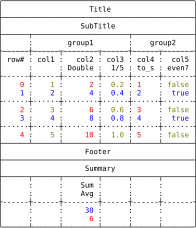
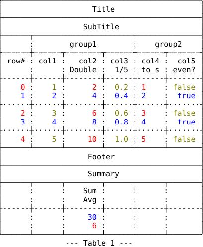

## Overview

Tablo is a port of [Matt Harvey's
Tabulo](https://github.com/matt-harvey/tabulo) Ruby gem to the Crystal
Language.

The first version of Tablo (v0.10.1) was released on November 30, 2021,
in the context of learning the Crystal language, which explains its
relative limitations compared to Tabulo v2.7, the current Ruby version
at that time, subject of the software port.

So this version of Tablo (v1.0) is a complete overhaul of the library.

Compared to the first version, it offers extended capabilities,
sometimes at the cost of a modified syntax. It also offers new features,
such as the ability to add a Summary table, powered by user-defined
functions (such as sum, mean, etc.), the ability to process any
Enumerable data, as well as elaborate layout possibilities: grouped
columns, different types of headers (title, subtitle, footer), linked or
detached border lines, etc.

While overall, Tablo remains, in terms of its functionalities, broadly
comparable, with a few exceptions, to the Tabulo v3.0 version of Matt
Harvey, the source code, meanwhile, has been deeply redesigned.
svg img


![] jpeg


![] svg


```crystal
# program name: create_table_1.cr
require "colorize"
require "tablo"

Tablo::Config.styler_tty_only = false

table = Tablo::Table.new([1, 2, 3, 4, 5],
  border_type: Tablo::BorderName::Fancy,
  title: Tablo::Heading.new("Title", framed: true),
  subtitle: Tablo::Heading.new("SubTitle", framed: true),
  footer: Tablo::Heading.new("Footer", framed: true),
  row_divider_frequency: 2,
  body_styler: ->(_c : Tablo::CellType, s : String, r : Tablo::CellData) {
    if r.row_index % 2 == 0
      if r.column_index % 2 == 0
        s.colorize(:red).to_s
      else
        s.colorize(:yellow).to_s
      end
    else
      s.colorize(:blue).to_s
    end
  },
  omit_last_rule: true) do |t|
  t.add_column("row#") { |n, i| i }
  t.add_group("")
  t.add_column("col1", &.itself)
  t.add_column(2, header: "col2\nDouble", &.*(2))
  t.add_column("col3\n1/5", &./(5))
  t.add_group("group1")
  t.add_column("col4\nto_s", &.to_s)
  t.add_column("col5\neven?", &.even?)
  t.add_group("group2")
end
puts table.pack
puts table.summary({
  2 => {header: "Sum\nAvg",

        proc1: ->(ary : Tablo::Numbers) { ary.sum.to_i },
        proc2: ->(ary : Tablo::Numbers) { (ary.sum / ary.size).to_i },
        body_styler: ->(c : Tablo::CellType, s : String, r : Tablo::CellData) {
          color = [:blue, :red, :yellow][r.row_index]?
          color.nil? ? s : s.colorize(color).to_s
        },
  },
},
  title: Tablo::Heading.new("Summary", framed: true)
)
```

