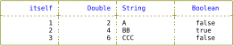
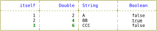
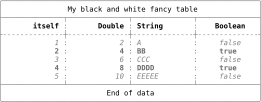

# Tutorial

[switch to API](API.md)

[](README.md)

## Table of contents

- [Getting started](#getting-started)
- [Borders](#borders)
- [Row types](#row-types)
  - [Header and Body](#header-and-body)
  - [Group](#group)
  - [Headings](#headings)
- [Rules](#rules)
- [Display frequency and repeated title](#display-frequency-and-repeated-title)
- [Extracting - Formatting - Styling](#extracting---formatting---styling)
  - [Extracting](#extracting)
  - [Formatting](#formatting)
  - [Styling](#styling)
- [Packing](#packing)
- [Summary](#summary)
- [Transpose](#transpose)

## Getting started

[:top:](#tutorial)
[:arrow_up:](#table-of-contents)
[:arrow_down:](#borders)

In this tutorial, we'll start with a very simple example, which we'll build on
as we go along to gradually discover all the possibilities offered by the
Tablo library.

Here's a first look at how to use Tablo to lay out a simple table from an array
of integers.

```crystal
require "tablo"

table = Tablo::Table.new([1, 2, 3]) do |t|
  t.add_column("itself", &.itself)
  t.add_column(2, header: "Double") { |n| n * 2 }
  t.add_column(:column_3, header: "String") { |n| ('@'.ord + n).chr.to_s * n }
end

puts table
```

or

```crystal
require "tablo"

table = Tablo::Table.new([1, 2, 3])
table.add_column("itself", &.itself)
table.add_column(2, header: "Double") {|n| n * 2}
table.add_column(:column_3, header: "String") { |n| ('@'.ord + n).chr.to_s * n }

puts table
```

output:

```
+--------------+--------------+--------------+
|       itself |       Double | String       |
+--------------+--------------+--------------+
|            1 |            2 | A            |
|            2 |            4 | BB           |
|            3 |            6 | CCC          |
+--------------+--------------+--------------+
```

A great deal of information can already be extracted from this simple example:

- The only parameter required to create the table is the data source (the
  array of integers), but to produce a result, you obviously need to add
  columns.
- Any number of columns can be defined, each requiring an identifier and
  a proc for extracting data from the source and, if necessary, modifying
  its type and value.
- The column identifier can be of type `String`, `Integer` or `Symbol`. By default,
  the column header takes the value of the identifier, unless the optional
  `header` parameter is used.
- Columns are the same width.
- We can see two types of row: header and body.
- Columns of numbers are aligned to the right, and columns of text to the left, for
  both headers and body.
- Default borders use the classic `Ascii` type.

## Borders

[:top:](#tutorial) [:arrow_up:](#getting-started) [:arrow_down:](#row-types)

Each border type is defined by a string of exactly 16 characters, which is
then converted into 16 strings of up to 1 character each. The definition
string can contain any character, but two of them have a special meaning:
during conversion, the uppercase E is replaced by an empty string, and the
uppercase S character is replaced by a space (a simple space may also be used,
of course).

_Please note that using the capital E character may cause alignment
difficulties._

The first 9 characters define the junction or intersection of horizontal and
vertical border lines.

| Index | Description                |
| :---: | :------------------------- |
|   0   | Top left corner            |
|   1   | Top middle junction        |
|   2   | Top right corner           |
|   3   | Middle left junction       |
|   4   | Middle middle intersection |
|   5   | Middle right junction      |
|   6   | Bottom left corner         |
|   7   | Bottom middle junction     |
|   8   | Bottom right corner        |

The next three characters define vertical separators in data rows.

| Index | Description               |
| :---: | :------------------------ |
|   9   | Left vertical separator   |
|  10   | Middle vertical separator |
|  11   | Right vertical separator  |

And finally, the last four characters define the different types of horizontal
border, depending on the type of data row or types of adjacent data rows (Row
type will be the subject of the next section).

| Index | Description             |
| :---: | :---------------------- |
|  12   | Title, subtitle, footer |
|  13   | Group                   |
|  14   | Header                  |
|  15   | Body                    |

To change a table's border type, simply assign the desired definition to the
`border` parameter when initializing the table. This can be done in two ways,
either by assigning the 16-character string directly, or by assigning the name
of one of the 7 predefined borders :

| Border name                 | Border string definition   |
| :-------------------------- | :------------------------- |
| `BorderName::Ascii`         | `"+++++++++\|\|\|----"`    |
| `BorderName::ReducedAscii`  | `"ESEESEESEESE----"`       |
| `BorderName::Modern`        | `"┌┬┐├┼┤└┴┘│││────"`       |
| `BorderName::ReducedModern` | `"ESEESEESEESE────"`       |
| `BorderName::Markdown`      | `"___\|\|\|___\|\|\|__-_"` |
| `BorderName::Fancy`         | `"╭┬╮├┼┤╰┴╯│:│─−-⋅"`       |
| `BorderName::Blank`         | `"EEEEEEEEEEEEEEEE"`       |

So, for example, to set the `ReducedAscii` border type, I can either:

- use the predefined border name (`Tablo::BorderName::ReducedAscii` or
  its symbol equivalent `:reduced_ascii`):

```crystal
table = Tablo::Table.new([1, 2, 3],
  border: Tablo::Border.new(:reduced_ascii)) do |t|
```

or

- use its definition string:

```crystal
table = Tablo::Table.new([1, 2, 3],
  border: Tablo::Border.new("ESEESEESEESE----")) do |t|
```

Output:

```
-------------- -------------- --------------
       itself         Double   String
-------------- -------------- --------------
            1              2   A
            2              4   BB
            3              6   CCC
-------------- -------------- --------------
```

## Row types

[:top:](#tutorial) [:arrow_up:](#borders) [:arrow_down:](#rules) [:arrow_lower_right:](#header-and-body)

### Header and Body

[:top:](#tutorial)
[:arrow_upper_left:](#row-types)
[:arrow_down:](#group)

The Header and Body data row types form the basis of table formatting. Other
types can be optionally added to establish the final layout: the Group row
type and Heading row types (Title, SubTitle and Footer).

### Group

[:top:](#tutorial) [:arrow_up:](#header-and-body) [:arrow_down:](#headings)

Adjacent columns can share a common header, above the column headers
themselves. This common header constitutes a Group row type.

To create a Group row, simply define a common header after each set of
adjacent columns to be grouped.

```crystal
require "tablo"

table = Tablo::Table.new([1, 2, 3]) do |t|
  t.add_column("itself", &.itself)
  t.add_column(2, header: "Double") {|n| n * 2}
  t.add_group("Numbers")
  t.add_column(:column_3, header: "String") { |n| ('@'.ord + n).chr.to_s * n }
  t.add_group("Text")
end

puts table
```

Output:

```
+-----------------------------+--------------+
|           Numbers           |     Text     |
+--------------+--------------+--------------+
|       itself |       Double | String       |
+--------------+--------------+--------------+
|            1 |            2 | A            |
|            2 |            4 | BB           |
|            3 |            6 | CCC          |
+--------------+--------------+--------------+
```

By default, Group headers are centered, but their alignment can be modified
globally at table initialization time with the `group_alignment` parameter,
or locally for a given group with the `alignment` parameter.

```crystal
table = Tablo::Table.new([1, 2, 3],
        group_alignment: Tablo::Justify::Left) do |t|
```

Output:

```
| Numbers                     | Text         |
```

or

```crystal
t.add_group("Text", alignment: Tablo::Justify::Left)
```

Output:

```
|           Numbers           | Text         |
```

Note that the group header can be empty, and that an empty group header is
automatically created if the last column group is not specified.

Group and header are intimately linked and only separated by a horizontal
line. For custom rendering, this line can be omitted by setting the Table
`omit_group_header_rule` parameter to `true`.

```crystal
require "tablo"

table = Tablo::Table.new([1, 2, 3],
        omit_group_header_rule: true) do |t|
    t.add_column("itself", &.itself)
    t.add_column(2, header: "Double") {|n| n * 2}
    t.add_group("Numbers")
    t.add_column(:column_3, header: "String") { |n| ('@'.ord + n).chr.to_s * n }
    t.add_column(:column_4, header: "Boolean") {|n| n.even?}
    t.add_group("Other data types")
end

puts table
```

Output:

```
+-----------------------------+-----------------------------+
|           Numbers           |       Other data types      |
|       itself |       Double | String       |    Boolean   |
+--------------+--------------+--------------+--------------+
|            1 |            2 | A            |     false    |
|            2 |            4 | BB           |     true     |
|            3 |            6 | CCC          |     false    |
+--------------+--------------+--------------+--------------+
```

### Headings

[:top:](#tutorial) [:arrow_up:](#group) [:arrow_lower_left:](#rules)

A formatted table can optionally include a title, subtitle and footer. Each of
these elements is of type Title, SubTitle or Footer, inherited from the
abstract class Heading (see API).

By default, when the table is initialized, their value is `nil`, so nothing is
displayed.

To display a title (or subtitle or footer), simply specify its value when
initializing the table.

```crystal
table = Tablo::Table.new([1, 2, 3],
        title: Tablo::Title.new("Data types alignment")) do |t|
```

Output:

```
                     Data types alignment
+-----------------------------+-----------------------------+
|           Numbers           |       Other data types      |
|           Numbers           |       Other data types      |
+--------------+--------------+--------------+--------------+
|       itself |       Double | String       |    Boolean   |
+--------------+--------------+--------------+--------------+
|            1 |            2 | A            |     false    |
|            2 |            4 | BB           |     true     |
|            3 |            6 | CCC          |     false    |
+--------------+--------------+--------------+--------------+
```

These elements can also be framed, possibly with line breaks before and after
(defined in the `Frame` struct initializer as `line_breaks_before` and
`line_breaks_after` with a value of 0).

The number of line breaks between adjacent elements is equal to the highest
value between the current element's `line_breaks_after` and the next element's
`line_breaks_before`.

```crystal
table = Tablo::Table.new([1, 2, 3],
  title: Tablo::Title.new("Data types alignment",
    frame: Tablo::Frame.new(line_breaks_before: 0, line_breaks_after: 2))) do |t|
```

Output:

```
+-----------------------------------------------------------+
|                    Data types alignment                   |
+-----------------------------------------------------------+

+-----------------------------+-----------------------------+
|           Numbers           |       Other data types      |
+--------------+--------------+--------------+--------------+
|       itself |       Double | String       |    Boolean   |
+--------------+--------------+--------------+--------------+
|            1 |            2 | A            |     false    |
|            2 |            4 | BB           |     true     |
|            3 |            6 | CCC          |     false    |
+--------------+--------------+--------------+--------------+
```

In summary, we have 6 types of data rows :

| Type     | Description                                                                                |
| :------- | :----------------------------------------------------------------------------------------- |
| Header   | Always displayed, unless `header_frequency:` is `nil` </br> or `masked_headers:` is `true` |
| Body     | Always displayed                                                                           |
| Group    | Optional                                                                                   |
| Title    | Optional                                                                                   |
| Subtitle | Optional                                                                                   |
| Footer   | Optional                                                                                   |

## Rules

[:top:](#tutorial) [:arrow_up:](#row-types) [:arrow_down:](#display-frequency-and-repeated-title)

Between the different types of rows, there are also different types of
separator lines, whose format varies according to the types of rows they
separate.

In the case of framed rows, for example, there may be a single dividing line,
making the rows linked, or on the contrary, there may first be a closing line
for the top row, possibly followed by line breaks before the opening line of
the bottom row.

These horizontal rules are formatted by the `horizontal_rule` method of class
Border.

## Display frequency and repeated title

[:top:](#tutorial) [:arrow_up:](#rules) [:arrow_down:](#extracting---formatting---styling)

An important parameter in table initialization is `header_frequency:`

- By default, it is set to 0, i.e. rows of data other than body are displayed
  only once, at the beginning for titles and headers, at the end for the footer.

```crystal
table = Tablo::Table.new([1, 2, 3],
        header_frequency: 0,
        title: Tablo::Title.new("Data types alignment",
          frame: Tablo::Frame.new(0, 2)),
        subtitle: Tablo::SubTitle.new("Only Booleans are centered by default"),
        footer: Tablo::Footer.new("End of page")) do |t|
```

Output:

```
+-----------------------------------------------------------+
|                    Data types alignment                   |
+-----------------------------------------------------------+

            Only Booleans are centered by default
|           Numbers           |       Other data types      |
+--------------+--------------+--------------+--------------+
|       itself |       Double | String       |    Boolean   |
+--------------+--------------+--------------+--------------+
|            1 |            2 | A            |     false    |
|            2 |            4 | BB           |     true     |
|            3 |            6 | CCC          |     false    |
+--------------+--------------+--------------+--------------+
                         End of page
```

- If set to `nil`, only body rows are displayed.

```crystal
table = Tablo::Table.new([1, 2, 3],
        header_frequency: nil,
```

Output:

```
+--------------+--------------+--------------+--------------+
|            1 |            2 | A            |     false    |
|            2 |            4 | BB           |     true     |
|            3 |            6 | CCC          |     false    |
+--------------+--------------+--------------+--------------+
```

- If set to `n` (positive), group or column headers are repeated every `n`
  rows, as are footers, but titles and subtitles are not repeated.

```crystal
table = Tablo::Table.new([1, 2, 3],
        header_frequency: 2,
```

Output:

```
+-----------------------------------------------------------+
|                    Data types alignment                   |
+-----------------------------------------------------------+

            Only Booleans are centered by default
+-----------------------------+-----------------------------+
|           Numbers           |       Other data types      |
+--------------+--------------+--------------+--------------+
|       itself |       Double | String       |    Boolean   |
+--------------+--------------+--------------+--------------+
|            1 |            2 | A            |     false    |
|            2 |            4 | BB           |     true     |
+--------------+--------------+--------------+--------------+
                         End of page
+-----------------------------+-----------------------------+
|           Numbers           |       Other data types      |
+--------------+--------------+--------------+--------------+
|       itself |       Double | String       |    Boolean   |
+--------------+--------------+--------------+--------------+
|            3 |            6 | CCC          |     false    |
|              |              |              |              |
+--------------+--------------+--------------+--------------+
                         End of page
```

However, if the title `repeated` parameter is set to `true`, we obtain title and
subtitle repetition.

```crystal
table = Tablo::Table.new([1, 2, 3],
        header_frequency: 2,
        title: Tablo::Title.new("Data types alignment",
          frame: Tablo::Frame.new(0, 2), repeated: true),
```

Output:

```
+-----------------------------------------------------------+
|                    Data types alignment                   |
+-----------------------------------------------------------+

            Only Booleans are centered by default
+-----------------------------+-----------------------------+
|           Numbers           |       Other data types      |
+--------------+--------------+--------------+--------------+
|       itself |       Double | String       |    Boolean   |
+--------------+--------------+--------------+--------------+
|            1 |            2 | A            |     false    |
|            2 |            4 | BB           |     true     |
+--------------+--------------+--------------+--------------+
                         End of page
+-----------------------------------------------------------+
|                    Data types alignment                   |
+-----------------------------------------------------------+

            Only Booleans are centered by default
+-----------------------------+-----------------------------+
|           Numbers           |       Other data types      |
+--------------+--------------+--------------+--------------+
|       itself |       Double | String       |    Boolean   |
+--------------+--------------+--------------+--------------+
|            3 |            6 | CCC          |     false    |
|              |              |              |              |
+--------------+--------------+--------------+--------------+
                         End of page
```

## Extracting - Formatting - Styling

[:top:](#tutorial) [:arrow_up:](#display-frequency-and-repeated-title) [:arrow_down:](#packing) [:arrow_lower_right:](#extracting)

At the heart of Tablo's operation lies the Cell, a data structure containing
all the elements required for display.

A cell, whether fed by data extracted from the source or directly from the
code, can span several lines. Even if it initially occupies a single line,
reducing the column width can result in a cell being displayed over several
lines.

You can limit the number of lines displayed by using the `header_wrap` or
`body_wrap` parameters when initializing the table (These 2 parameters are
global to the table, and cannot be set on individual columns). If the whole
cell content cannot be displayed due to this restriction, a special character
(tilde by default) is inserted in the right-hand padding area of the last line
of the cell (unless right padding is set to 0 for the column).

Note here the use of the `row_divider_frequency` parameter to separate body
rows

```crystal
require "tablo"

table = Tablo::Table.new(["abc", "def\nghi\njkl\nmno\npqr", "xyz"],
  border: Tablo::Border.new("+++++++++|||---."),
  header_wrap: 2,
  body_wrap: 3,
  row_divider_frequency: 1) do |t|
  t.add_column("A\nfour\nlines\ncell", &.itself)
end

puts table
```

Output:

```
+--------------+
| A            |
| four        ~|
+--------------+
| abc          |
+..............+
| def          |
| ghi          |
| jkl         ~|
+..............+
| xyz          |
+--------------+
```

In addition, to have greater control over the line break, we can use the
`wrap_mode` parameter to choose between `Rune` (Roughly equivalent to
a character) and `Word` when cutting a line.

To use Tablo with non-Romanic languages, it is mandatory to use the
`naqviz/uni_char_width` shard so that the width of each grapheme is correctly
managed, without impacting alignment.

To do this, you need to:

- Add the dependencies to your shard.yml:

```yaml
dependencies:
  tablo:
    github: hutou/tablo
  uniwidth:
    github: naqvis/uni_char_width
```

- Run `shards install`
- And insert the lines

```crystal
require "tablo"
require "tablo"
require "uniwidth"
```

at the beginning of your app.

### Extracting

[:top:](#tutorial)
[:arrow_upper_left:](#extracting---formatting---styling)
[:arrow_down:](#formatting)

The cell `value` attribute contains the raw data.

If directly given as argument to Headings or Group, the cell is a `TextCell`
as it is not related to source data.

If extracted from the source (body rows), the cell is of type `DataCell`, and
the corresponding column header is also a `DataCell` (as it depends on the
type of body `value` for alignment).

The `cell_data` attribute, specific to the `DataCell` type, provides access to
the cell's coordinates (`row_index` and `column_index`), as well as the
`body_value`. This information is used to activate conditional formatting and
styling.

```crystal
struct CellData
getter body_value, row_index, column_index
    def initialize(@body_value : CellType, @row_index : Int32, @column_index : Int32)
    end
end
```

The type of `value` is `Tablo::CellType`, which is simply defined as an empty
module restriction type:

```crystal
module Tablo::CellType
end
```

This module is already included in all Crystal main scalar types. To
use a (non or less used) scalar type or a user defined class or struct, it is
mandatory to include it by reopening the class or struct.

For example, to allow a cell value to contain an array, we could do :

```crystal
class Array
    include Tablo::CellType
end
```

and:

```crystal
require "tablo"

table = Tablo::Table.new([[1, 2], [3, 4]]) do |t|
  t.add_column("itself") { |n| n }
end

puts table
```

would output:

```
+--------------+
| itself       |
+--------------+
| [1, 2]       |
| [3, 4]       |
+--------------+
```

### Formatting

[:top:](#tutorial) [:arrow_up:](#extracting) [:arrow_down:](#styling)

Formatting consists in applying a transformation to the raw data (the `value`)
to obtain a character string ready to be displayed. The simplest
transformation (which is also the one applied by default) is simply a call to
the `to_s` method.

Using a proc `formatter` allows you to customize formatting in a variety of
ways, from using `sprintf` formatting strings for numeric values to various
`String` methods for text and specific `Tablo::Util` methods for both.

A formatter proc can take four forms : the first two apply equally to TextCell
and DataCell and are applied unconditionally on `value`.

The first form expects one parameter (`value`) and the second two: `value` and
`width` (column width).

Here is an example of the first form:

```crystal
require "tablo"

table = Tablo::Table.new([1, 2, 3]) do |t|
  t.add_column("itself", &.itself)
  t.add_column(2, header: "Double") { |n| n * 2 }
  t.add_column(3, header: "Float",
    header_formatter: ->(value : Tablo::CellType) { value.as(String).upcase },
    body_formatter: ->(value : Tablo::CellType) {
      "%.3f" % value.as(Float)
    }) { |n| n ** 0.5 }
end

puts table
```

Output:

```
+--------------+--------------+--------------+
|       itself |       Double |        FLOAT |   <1>
+--------------+--------------+--------------+
|            1 |            2 |        1.000 |
|            2 |            4 |        1.414 |
|            3 |            6 |        1.732 |
+--------------+--------------+--------------+
```

<1> Note that the FLOAT column is aligned to the right, as its alignment is
governed by the type of `value`, which is a float.

If the formatting were done directly at the data extraction level, `value`
would be of type `String` and column would be aligned to the left.

```crystal
require "tablo"

table = Tablo::Table.new([1, 2, 3]) do |t|
  t.add_column("itself", &.itself)
  t.add_column(2, header: "Double") { |n| n * 2 }
  t.add_column(3, header: "Float",
    header_formatter: ->(value : Tablo::CellType) {
    value.as(String).upcase }) { |n| "%.3f" % (n ** 0.5)
  }
end
puts table
```

Output:

```
+--------------+--------------+--------------+
|       itself |       Double | FLOAT        |
+--------------+--------------+--------------+
|            1 |            2 | 1.000        |
|            2 |            4 | 1.414        |
|            3 |            6 | 1.732        |
+--------------+--------------+--------------+
```

To illustrate the 2nd form, we will use the `Tablo::Util.stretch` method,
which can be useful on groups or headings.

```crystal
require "tablo"

table = Tablo::Table.new([1, 2, 3]) do |t|
  t.add_column("itself", &.itself)
  t.add_column(2, header: "Double") { |n| n * 2 }
  t.add_group("Numbers",
    formatter: ->(value : Tablo::CellType, width : Int32) {
      Tablo::Util.stretch(value.as(String), width, ' ')
    })
  t.add_column(:column_3, header: "String") { |n| ('@'.ord + n).chr.to_s * n }
  t.add_column(:column_4, header: "Boolean") { |n| n.even? }
  t.add_group("Other data types")
end

puts table
```

Output:

```
+-----------------------------+-----------------------------+
|  N   u   m   b   e   r   s  |       Other data types      |
+--------------+--------------+--------------+--------------+
|       itself |       Double | String       |    Boolean   |
+--------------+--------------+--------------+--------------+
|            1 |            2 | A            |     false    |
|            2 |            4 | BB           |     true     |
|            3 |            6 | CCC          |     false    |
+--------------+--------------+--------------+--------------+
```

Form 3 and form 4 apply only on DataCell cell types, as they use the
`cell_data` parameter to conditionnally format the `value`.

Here is an exemple of form 3 with another method from `Tablo::Util`, which use
the `column_index` as formatting condition.

```crystal
require "tablo"

table = Tablo::Table.new([-30.00001, -3.14159, 0.0, 1.470001, 5.78707, 10.0],
  body_formatter: ->(value : Tablo::CellType, cell_data : Tablo::CellData) {
    case cell_data.column_index
    when 1 then Tablo::Util.dot_align(value.as(Float), 4, Tablo::Util::DotAlign::Empty)
    when 2 then Tablo::Util.dot_align(value.as(Float), 4, Tablo::Util::DotAlign::Blank)
    when 3 then Tablo::Util.dot_align(value.as(Float), 4, Tablo::Util::DotAlign::Dot)
    when 4 then Tablo::Util.dot_align(value.as(Float), 4, Tablo::Util::DotAlign::DotZero)
    else        value.as(Float).to_s
    end
  }) do |t|
  t.add_column("itself", &.itself)
  t.add_column("1 - Empty", &.itself)
  t.add_column("2 - Blank", &.itself)
  t.add_column("3 - Dot", &.itself)
  t.add_column("4 - DotZero", &.itself)
end

puts table
```

Output:

```
+--------------+--------------+--------------+--------------+--------------+
|       itself |    1 - Empty |    2 - Blank |      3 - Dot |  4 - DotZero |
+--------------+--------------+--------------+--------------+--------------+
|    -30.00001 |     -30      |     -30      |     -30.     |     -30.0    |
|     -3.14159 |      -3.1416 |      -3.1416 |      -3.1416 |      -3.1416 |
|          0.0 |              |       0      |       0.     |       0.0    |
|     1.470001 |       1.47   |       1.47   |       1.47   |       1.47   |
|      5.78707 |       5.7871 |       5.7871 |       5.7871 |       5.7871 |
|         10.0 |      10      |      10      |      10.     |      10.0    |
+--------------+--------------+--------------+--------------+--------------+
```

Incidentally, this last example displays all the formatting possibilities of
the `Tablo::Util.dot_align` method.

Compared to the third form, form 4 also allows the use of the width value. +
Its usefulness seems less obvious, however.

Overview of the 4 different forms of formatter procs:
| Forms of formatter procs | Parameter and types, in order |
| -- | -- |
| 1st form | `value` : `Tablo::CellType` <br />used by: `TextCell` or `DataCell`|
| 2nd form | `value` : `Tablo::CellType`, `width` : `Int32` <br />used by: `TextCell` or `DataCell` |
| 3rd form | `value` : `Tablo::CellType`, `cell_data` : `Tablo::CellData` <br />used by: `DataCell`|
| 4th form | `value` : `Tablo::CellType`, `cell_data` : `Tablo::CellData`, <br />`width` : `Int32` used by: `DataCell` |

### Styling

[:top:](#tutorial) [:arrow_up:](#formatting) [:arrow_lower_left:](#packing)

as they depend on the terminal's capabilities. There are therefore
2 complementary ways of proceeding:

- play with the mode (underlined, bold, italic...)
- use color

This can be done using ANSI code sequences, or preferably, using the
`colorize` module of the standard library.

In this section, we'll be using color, altered characters and graphic borders
with the Fancy border type. Output will therefore be presented as SVG images,
so as to guarantee perfect rendering, whatever the medium used for display.

For styling, there are 5 forms of procs.

The first uses only the (formatted) content as a parameter, and therefore does not
allow conditional styling.

Let's look at a simple example, with yellow borders and blue headers.

```crystal
require "tablo"
require "colorize"

table = Tablo::Table.new([1, 2, 3],
  border: Tablo::Border.new(:fancy, styler: ->(border_char : String) {
    border_char.colorize(:yellow).to_s
  }),
  header_styler: ->(content : String) { content.colorize(:blue).to_s }) do |t|
  t.add_column("itself", &.itself)
  t.add_column(2, header: "Double") { |n| n * 2 }
  t.add_column(:column_3, header: "String") { |n| ('@'.ord + n).chr.to_s * n }
  t.add_column(:column_4, header: "Boolean") { |n| n.even? }
end

puts table
```

<p>  </p>

Cool! Let's do now some conditional styling, painting in bold green all values
greater than 2 in all numeric columns and underlining the `true` boolean value
in fourth column: this is the third form of styling.
Just add, at the table level before `header_styler`, the following lines :

```crystal
body_styler: ->(value : Tablo::CellType, content : String) {
  case value
  when Int32
    value > 2 ? content.colorize.fore(:green).mode(:bold).to_s : content
  else
    value == true ? content.colorize.mode(:underline).to_s : content
  end
},
```

<p>  </p>

Let's end with a final example, with a black-and-white look: how do you
display rows alternately in light gray (with a bit of italics) and dark gray
to make them easier to read?

This would be the 4th form.

```crystal
require "tablo"
require "colorize"

table = Tablo::Table.new([1, 2, 3, 4, 5],
  title: Tablo::Title.new("My black and white fancy table", frame: Tablo::Frame.new),
  footer: Tablo::Footer.new("End of data", frame: Tablo::Frame.new),
  border: Tablo::Border.new(:fancy, ->(border_char : String) {
    border_char.colorize(:light_gray).to_s
  }),
  body_styler: ->(_value : Tablo::CellType, cell_data : Tablo::CellData, content : String) {
    if cell_data.row_index.even?
      "\e[3m" + content.colorize(:light_gray).to_s + "\e[0m"                      <1>
    else
      content.colorize.fore(:dark_gray).mode(:bold).to_s
    end
  },
  header_styler: ->(content : String) { content.colorize.mode(:bold).to_s }) do |t|
  t.add_column("itself", &.itself)
  t.add_column(2, header: "Double") { |n| n * 2 }
  t.add_column(:column_3, header: "String") { |n| ('@'.ord + n).chr.to_s * n }
end

puts table
```

`<1>` From version 1.10 onwards, Crystal does support italic mode, and the use
of ANSI sequences is given here simply as an example.

<p>  </p>

Overview of the 5 different forms of styler procs:

| Forms of styler procs | Parameter and types, in order                                                                                                                            |
| --------------------- | :------------------------------------------------------------------------------------------------------------------------------------------------------- |
| 1st form              | `(formatted) content` : `String` <br />used by: `Border`, `TextCell` or `DataCell`                                                                       |
| 2nd form              | `(formatted) content` : `String`, `line_index` : `Int32` <br /> used by: `TextCell`                                                                      |
| 3rd form              | `value` : `Tablo::CellType`, `(formatted) content` : `String` <br /> used by: `DataCell`                                                                 |
| 4th form              | `value` : `Tablo::CellType`, `cell_data` : `Tablo::CellData`, <br /> `(formatted) content` : `String` used by: `DataCell`                                |
| 5th form              | `value` : `Tablo::CellType`, `cell_data` : `Tablo::CellData`, <br /> `(formatted) content` : `String`, `line_index` : `Int32` <br /> used by: `DataCell` |

## Packing

[:top:](#tutorial) [:arrow_up:](#extracting---formatting---styling) [:arrow_down:](#summary)

In the previous examples, the notion of column width was used. For a better
understanding, the diagram below highlights the structure of a column.

<p>  </p>

As we saw at the start of this tutorial, by default, all columns have the same
width, i.e. 12 characters.

Of course, this value can be modified globally when initializing the table, or
individually when defining columns. The same applies to left and right
padding, as well as to the padding character (a space, by default).

The border width is 1 character maximum, but can be 0 (i.e. no border) if the
letter E is used in the border definition string.

The `pack` method is a welcome aid to table formatting. It accepts
3 parameters, all optional:

- `width`: total width required for the formatted table. If no `width` is
  given and if the value of parameter `Config.terminal_capped_width` is true,
  the value of `width` is read from the size of the terminal, otherwise its
  value is `nil` and in that case, only `starting_widths == AutoSized` has an
  effect.

- `starting_widths` : column widths taken as starting point for resizing,
  possible values are :
  - `Current` : resizing starts from columns current width
  - `Initial` : current values are reset to their initial values, at column
    definition time \* `AutoSized` : current values are set to their 'best fit'
    values, ie they are automatically adapted to their largest content
- `except`: column or array of columns excluded from being resized,
  identified by their label

The following examples will illustrate the behaviour of the different
parameters values, starting from the 'standard' one, with all column widths to
their default value : 12 characters.

```crystal
require "tablo"

data = [
  [1, "Box", "Orange", "Elephant", "Mont St Michel"],
]
table = Tablo::Table.new(data) do |t|
  t.add_column("Primes") { |n| n[0].as(Int32) }
  t.add_column(2, header: "Things") { |n| n[1].as(String) }
  t.add_column(:fruits, header: "Fruits") { |n| n[2].as(String) }
  t.add_column(3, header: "Animals") { |n| n[3].as(String) }
  t.add_column("Famous\nSites") { |n| n[4].as(String) }
end

puts table
puts "table width = #{table.total_table_width}"
```

Table standard output, using default width values, without any packing:

```
 puts table
 +--------------+--------------+--------------+--------------+--------------+
 |       Primes | Things       | Fruits       | Animals      | Famous       |
 |              |              |              |              | Sites        |
 +--------------+--------------+--------------+--------------+--------------+
 |            1 | Box          | Orange       | Elephant     | Mont St      |
 |              |              |              |              | Michel       |
 +--------------+--------------+--------------+--------------+--------------+
 table width = 76
```

Using default `pack` parameters (ie: none !), we get an optimal packing

```
 puts table.pack
 +--------+--------+--------+----------+----------------+
 | Primes | Things | Fruits | Animals  | Famous         |
 |        |        |        |          | Sites          |
 +--------+--------+--------+----------+----------------+
 |      1 | Box    | Orange | Elephant | Mont St Michel |
 +--------+--------+--------+----------+----------------+
 table width = 56
```

But using `pack` with same table width (56) on initial widths values gives
a significantly poorer result

```
 puts table.pack(56, starting_widths: Tablo::StartingWidths::Initial)
 +----------+----------+----------+----------+----------+
 |   Primes | Things   | Fruits   | Animals  | Famous   |
 |          |          |          |          | Sites    |
 +----------+----------+----------+----------+----------+
 |        1 | Box      | Orange   | Elephant | Mont St  |
 |          |          |          |          | Michel   |
 +----------+----------+----------+----------+----------+
 table width = 56
```

This is due to the way Tablo reduces or increases column size. See the
description of the algorithm in the releated section for `Table.pack` in
API.

Using the `width` parameter, any table width can be obtained, by reducing or
increasing the width of each column progressively to reach the desired table
width

```
 puts table.pack(30)
 +-----+-----+-----+-----+----+
 | Pri | Thi | Fru | Ani | Fa |
 | mes | ngs | its | mal | mo |
 |     |     |     | s   | us |
 |     |     |     |     | Si |
 |     |     |     |     | te |
 |     |     |     |     | s  |
 +-----+-----+-----+-----+----+
 |   1 | Box | Ora | Ele | Mo |
 |     |     | nge | pha | nt |
 |     |     |     | nt  | St |
 |     |     |     |     | Mi |
 |     |     |     |     | el |
 +-----+-----+-----+-----+----+
 table width = 30
```

or

```
 puts table.pack(90)
 +----------------+-----------------+-----------------+-----------------+-----------------+
 |         Primes | Things          | Fruits          | Animals         | Famous          |
 |                |                 |                 |                 | Sites           |
 +----------------+-----------------+-----------------+-----------------+-----------------+
 |              1 | Box             | Orange          | Elephant        | Mont St Michel  |
 +----------------+-----------------+-----------------+-----------------+-----------------+
 table width = 90
```

There is, however, a limit to the reduction: each column must be able to
accommodate at least one character. Here, we're asking for a table width of
15, but the minimum size to respect this rule is 21!

```
 puts table.pack(15)
 +---+---+---+---+---+
 | P | T | F | A | F |
 | r | h | r | n | a |
 | i | i | u | i | m |
 | m | n | i | m | o |
 | e | g | t | a | u |
 | s | s | s | l | s |
 |   |   |   | s | S |
 |   |   |   |   | i |
 |   |   |   |   | t |
 |   |   |   |   | e |
 |   |   |   |   | s |
 +---+---+---+---+---+
 | 1 | B | O | E | M |
 |   | o | r | l | o |
 |   | x | a | e | n |
 |   |   | n | p | t |
 |   |   | g | h | S |
 |   |   | e | a | t |
 |   |   |   | n | M |
 |   |   |   | t | i |
 |   |   |   |   | c |
 |   |   |   |   | h |
 |   |   |   |   | e |
 |   |   |   |   | l |
 +---+---+---+---+---+
```

If, with the parameter `starting_widths == Startingwidths::AutoSized` by
default (set by `Config.starting_widths`), the `pack` method automatically
adapts the width of columns to their largest content (body or header) before
resizing, this requires you to go through the entire source dataset, which can
be costly in terms of performance in some cases.

This behavior can be avoided, but possibly with a loss of quality, by changing
the value of `starting_widths` to `Current` or `Initial`. In this case,
however, a value for `width` must be supplied, either directly or by reading
the terminal size, otherwise `pack` will become a non-operation.

Finally, using the `except` parameter, you can temporarily freeze the size of
one or more columns at their current value, so that they are excluded from
resizing.

stored in 2 different attributes: the current value and the initial value
(never subsequently modified).

The `pack` method simply modifies the current column width value, and the
`to_s` method then takes care of the layout, and we can save the table in its
output layout in a string with :

```crystal
formatted_table = table.to_s
```

It is therefore equivalent to write :

```crystal
table.pack
puts table
```

or

```crystal
puts table.pack
```

To sum up:

| Type of call                                               | Results, with `StartingWidths::AutoSized` as default and no columns excluded                                                                                                                                |
| :--------------------------------------------------------- | :---------------------------------------------------------------------------------------------------------------------------------------------------------------------------------------------------------- |
| `table.pack`                                               | <ul><li>Automatically adapts columns to their largest content</li><li>Modifies current values of column width</li></ul>                                                                                     |
| `table.pack(40)`                                           | <ul> <li>Automatically adapts columns to their largest content</li> <li>Modifies current values of column width</li> <li>Reduces or increases column widths to meet total table size requirements</li></ul> |
| `table.pack(starting_widths: StartingWidths::Current`)     | <ul><li>No-op</li></ul>                                                                                                                                                                                     |
| `table.pack(40, starting_widths: StartingWidths::Current`) | <ul><li>Reduces or increases column widths to meet total table size requirements</li></ul>                                                                                                                  |
| `table.pack(starting_widths: StartingWidths::Initial`)     | <ul><li> Only resets current column values to their initial values, no packing is done</li></ul>                                                                                                            |
| `table.pack(40, starting_widths: StartingWidths::Initial`) | <ul><li> Resets current column values to their initial values</li> <li>Reduces or increases column widths to meet total table size requirements</li></ul>                                                   |

## Summary

[:top:](#tutorial) [:arrow_up:](#packing) [:arrow_down:](#transpose)

The Tablo library offers a very basic yet useful summary method.
This method must be considered as _*experimental*_ however, as it obviously needs
improvement. So, its usage may change in the future.

At present, it can be used to perform calculations on individual columns of data,
and, often at the cost of some code duplication, to perform calculations between columns.
Clearly not a DRY API!

Here's an example of how it works now and what it can do for you:

```crystal
require "tablo"

record Entry, product : String, price : Int32
invoice = [
  Entry.new("Laptop", 98000),
  Entry.new("Printer", 15499),
  Entry.new("Router", 9900),
  Entry.new("Accessories", 6450),
]

tbl = Tablo::Table.new(invoice,
  omit_last_rule: true,
  title: Tablo::Title.new("Invoice")) do |t|
  t.add_column("Product",
    &.product)
  t.add_column("Price",
    body_formatter: ->(value : Tablo::CellType) {
      "%.2f" % (value.as(Int32) / 100)
    }, &.price)
  t.add_column(:tax, header: "Tax (20%)",
    body_formatter: ->(value : Tablo::CellType) {
      "%.2f" % (value.as(Int32) / 100)
    }) { |n| (n.price * 0.2).to_i }
end

tbl.summary(
  {
    "Product" => {
      proc: [
        {1, ->(_ary : Array(Tablo::CellType)) {
          "Total excl.".as(Tablo::CellType)
          "VAT (Total)".as(Tablo::CellType)
        }},
        {3, ->(_ary : Array(Tablo::CellType)) {
          "Total incl.".as(Tablo::CellType)
        }},
      ],
    },
    "Price" => {
      body_formatter: ->(value : Tablo::CellType) {
        value.nil? ? "" : "%.2f" % (value.as(Int32) / 100)
      },
      proc: [
        {1, ->(ary : Array(Tablo::CellType)) {
          (ary.map &.as(Int32)).sum.as(Tablo::CellType)
        }},
        {3, ->(ary : Hash(Tablo::LabelType, Array(Tablo::CellType))) {
          sum_price = (ary["Price"].map &.as(Int32)).sum
          sum_tax = (ary[:tax].map &.as(Int32)).sum
          (sum_price + sum_tax).as(Tablo::CellType)
        }},
      ],
    },
    :tax => {
      body_formatter: ->(value : Tablo::CellType) {
        value.nil? ? "" : "%.2f" % (value.as(Int32) / 100)
      },
      proc: {2, ->(ary : Array(Tablo::CellType)) {
        (ary.map &.as(Int32)).sum.as(Tablo::CellType)
      }},
    },
  }, masked_headers: true
)

puts tbl
puts tbl.summary
```

Output:

```
                     Invoice
 +--------------+--------------+--------------+
 | Product      |        Price |    Tax (20%) |
 +--------------+--------------+--------------+
 | Laptop       |       980.00 |       196.00 |
 | Printer      |       154.99 |        30.99 |
 | Router       |        99.00 |        19.80 |
 | Accessories  |        64.50 |        12.90 |
 +--------------+--------------+--------------+
 | Total excl.  |      1298.49 |              |
 | VAT (Total)  |              |       259.69 |
 | Total incl.  |      1558.18 |              |
 +--------------+--------------+--------------+
```

Let's take a closer look at the source code.

The first part - the creation of the main table - calls for no particular
comment (except perhaps the use of a more realistic data source than the
previous arrays of integers!)

Calling the `summary` method, with its 2 parameters, creates a new `Table`
instance, and calling the same method without arguments returns this same
instance, ready to be displayed.

The first parameter (`summary_def`) defines all the calculations to be performed
on the data, as well as their layout.

The type of `summary_def` is : `Hash(LabelType, NamedTuple(...))`. The hash key is
therefore a column identifier (`LabelType` is an alias of `String | Symbol
| Int32`).

The `NamedTuple` may have up to 8 entries :

| Hash key           | Type of hash value  |
| :----------------- | :------------------ |
| `header`           | `String`            |
| `header_alignment` | `Justify`           |
| `header_formatter` | `DataCellFormatter` |
| `header_styler`    | `DataCellStyler`    |
| `body_alignment`   | `Justify`           |
| `body_formatter`   | `DataCellFormatter` |
| `body_styler`      | `DataCellStyler`    |
| `proc`             | `SummaryProcs`      |

The latter - `SummaryProcs`- is a tad complex and can take several forms.
Basically, it is a tuple of 2 elements :

- An `Int32`, which indicates the position (line) of the proc result in the column
- A `proc` or an array of procs, which performs the calculation and expects
  as parameter either an `Array(CellType)` or a `Hash(LabelType,
Array(CellType))`

The second parameter (`options`) ...

Outch!

Looking again at the source code, we see that :

- The `:tax` column has 2 entries, of type `Tuple`:
  - `body_formatter:` and its associated proc which performs the
    conversion from cents to currency units, and checks that the cell is
    not nil (this is necessary, as of the 3 summary lines, the 1st and
    3rd are not fed).
  - `proc:` a tuple defined by the number of the summary line to be fed,
    and the proc performing the calculation. The latter takes as
    parameter a `CellType` array (the "Tax (20%)" data column), converts
    it to an array of integers before summing and converting the result

## Transpose

[:top:](#tutorial) [:arrow_up:](#summary)
